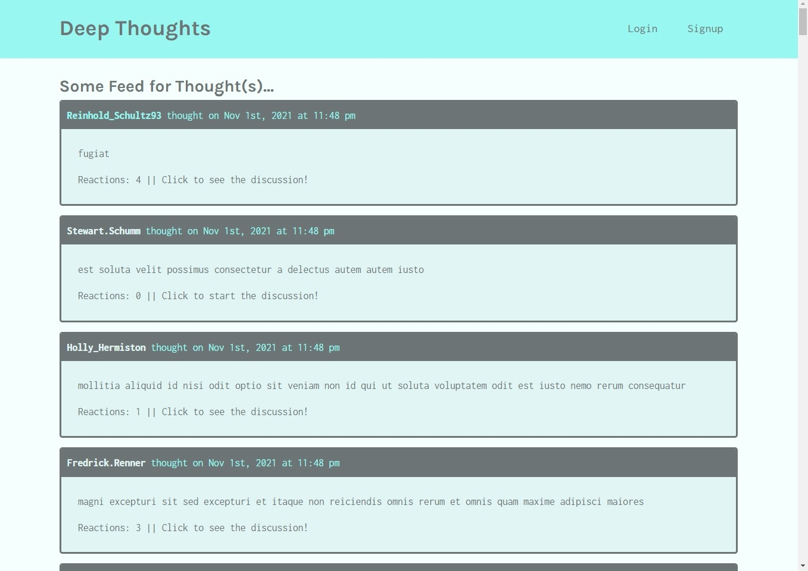

# deep-thoughts

  

  ## Description 
  
  A social media application where users can create an account, post their thoughts for others to see, and interact with other users through these thoughts.
  

  ## Table of Contents
  
  * [Installation](#installation)
  * [Usage](#usage)
  * [Contributing](#Contributing)
  * [Tests](#tests)
  * [Questions](#questions)
  * [License](#license)
  
  
  ## Installation
  
  None. Deployed at *[https://infinite-dusk-32225.herokuapp.com/](https://infinite-dusk-32225.herokuapp.com/)*.
  
  
  ## Usage 
  
  Visit the *[site](https://infinite-dusk-32225.herokuapp.com/)*, sign up, and interact with other users! 
  
  
  ## Contributing

  
  
  [Contributor Covenant](https://www.contributor-covenant.org/version/2/0/code_of_conduct/)

  ## Tests
  
  None.

  ## Questions

  You can checkout my repos here: [https://github.com/jfocha](https://github.com/jfocha)

  For further questions, I can also be reached at jfocha@gmail.com

  ## License
  
  Copyright (c) 2021 by Joe Focha

  This application license is covered under [MIT License](https://choosealicense.com/licenses/mit/)
  
  Permission is hereby granted, free of charge, to any person obtaining a copy of this software and associated documentation files (the 'Software'), to deal in the Software without restriction, including without limitation the rights to use, copy, modify, merge, publish, distribute, sublicense, and/or sell copies of the Software, and to permit persons to whom the Software is furnished to do so, subject to the following conditions:     The above copyright notice and this permission notice (including the next paragraph) shall be included in all copies or substantial portions of the Software.     THE SOFTWARE IS PROVIDED 'AS IS', WITHOUT WARRANTY OF ANY KIND, EXPRESS OR IMPLIED, INCLUDING BUT NOT LIMITED TO THE WARRANTIES OF MERCHANTABILITY, FITNESS FOR A PARTICULAR PURPOSE AND NONINFRINGEMENT. IN NO EVENT SHALL THE AUTHORS OR COPYRIGHT HOLDERS BE LIABLE FOR ANY CLAIM, DAMAGES OR OTHER LIABILITY, WHETHER IN AN ACTION OF CONTRACT, TORT OR OTHERWISE, ARISING FROM, OUT OF OR IN CONNECTION WITH THE SOFTWARE OR THE USE OR OTHER DEALINGS IN THE SOFTWARE.
  
  ---

  
